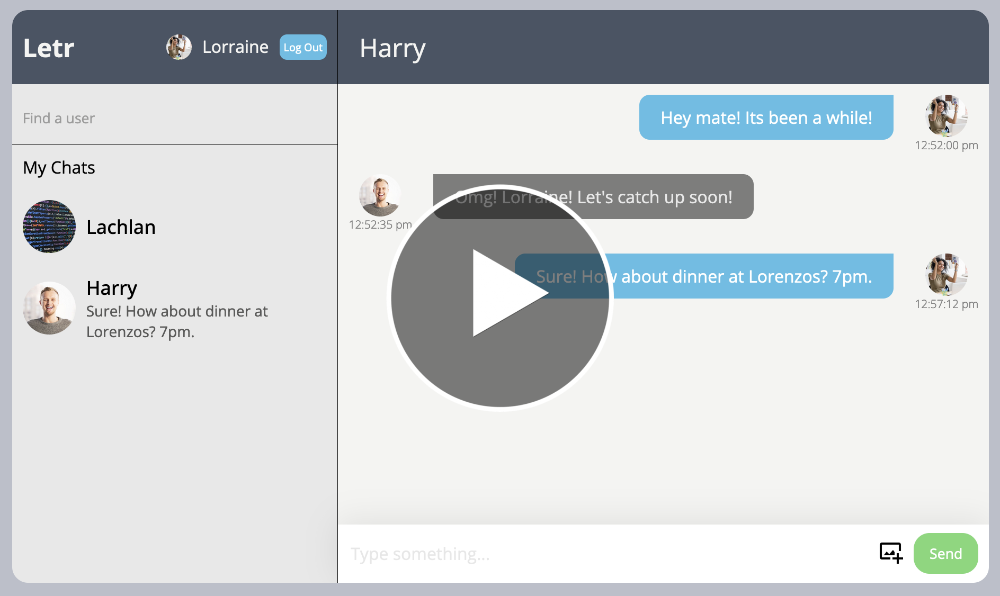

# Letr - a perfect modern messaging app.

[Click Here](https://storied-seahorse-83953f.netlify.app/) to access the application.

**Info**

Simple messaging app with these features:

Dark & light mode switch.

Instant messaging between profiles.

Edit page (edit your profile picture & name).

Login & Signup page.

Mobile & browser friendly.

**How To Use**

1. Sign Up & log in

1. Type the name of who you want to talk to into the 'Find a user'.

1. Start chatting!

1. Send pictures & messages to your friends.

1. You can also switch between dark & light mode. (toggle button on the top right).

1. Enjoy & have fun messaging your friends!

**Website Video Preview**

Click this image link to youtube for a video demo.

**Tech Stack**

* ReactJS
* Firebase
* Javascript
* SCSS3
* CSS
* Netlify

**Firebase**

We had three firebase collections.

 - Chats
 - Users
 - UserChats 

**Special Thanks**

To Joel & Loden for their tremendous advice & assistance. 
(Also we're going to miss you guys, thank you so much for a great course! - David, Lukas & Nelson).

**Extra**

Any feedback would be appreciated! Thank you for using our website/app!